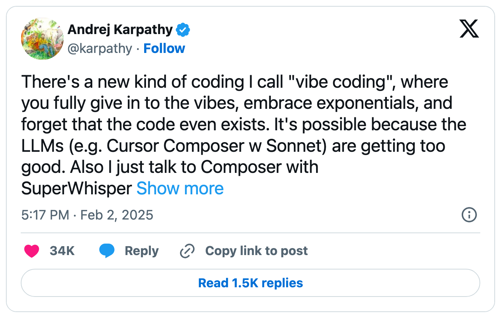
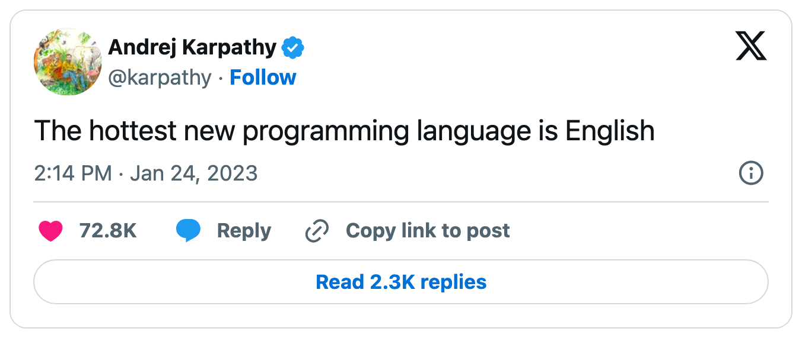
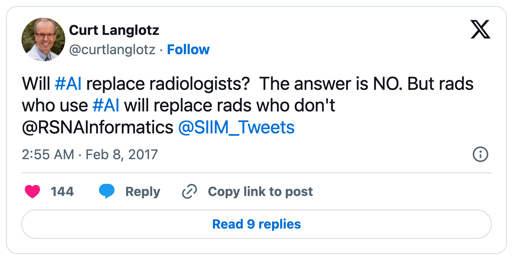

## Full disclosure {.center}

<!--
CHEAT SHEET (delete before presenting)

Build:        quarto render slides.qmd          -> slides.html
Live preview: quarto preview slides.qmd         -> auto-reloads in browser

New slide:        start a line with "## Title"
Section divider:  "# SECTION TITLE"
Speaker notes:    ::: {.notes}  ... :::   (press 's' in browser for presenter view)
Two columns:      ::: {.columns} / ::: {.column width="50%"} ... ::: / :::
Incremental list: add {.incremental} after a "##" heading
Fragment reveal:  add [text]{.fragment}

STATUS: second trim pass done. Cut/merged: harness slide (now a fragment
on the agent slide), session transcript (live demo covers it; restore from
git if not demoing), "what your summer produces" (folded into the
coursework slide), flywheel (folded into the seed story), third
where-rules example, "norms vary" ground rule, various line-level
tightening. Kept by request: workflow-maintenance slide, three-generations
slide. ★ DO NOT CUT — the lab-notebook slide (practice 7) is, in Anna's
view, the single most important idea in the whole talk. Never propose
trimming it; if anything, give it MORE room. Rough timing (~58-60 min —
fits the hour if Q&A can spill a little):
  ~5   hook + reframe
  ~11  part 1: what you're working with (LLMs, agents, harnesses)
  ~4   part 2: research is a different game
  ~9   part 3: the mental model
  ~20  part 4: running the lab (9 practices; the overnight-campaign slide is scoped/cuttable)
  ~9   part 5: when it goes wrong
  ~8   part 6: the student catch (incl. the jobs-anxiety slide)
  ~4   part 7: getting started + takeaways (+ ~5 min questions)

NOTE: this comment must live INSIDE a slide (below a ## heading) — any
content before the first heading becomes a blank slide in reveal.js.
-->

This talk was prepared the way it recommends:

I sketched the argument. My AI agent drafted the slides.

**I own all the claims.**

::: {.notes}
~1 min. Open with this — it's the whole talk in miniature. The agent did the
typing; I did the thinking and the reviewing. If anything on these slides is
wrong, that's on me, not the tool. That division of labor is the next hour.
:::

## Why not call it "vibe coding"?

::: {.columns}
::: {.column width="52%"}
*Vibe coding*: prompt, accept, run, hope.

Fine for a throwaway script —
not fine when someone has to
**trust the result**.

. . .

*Delegated coding*: the AI does
the work; **you stay in charge
and accountable**.
:::
::: {.column width="48%"}
{width="100%"}
:::
:::

. . .

The skill you'll need this summer is not prompting.
It's **management**: scoping tasks, setting standards, reviewing the work.

::: {.notes}
~3 min. The term is Andrej Karpathy's — the Feb 2025 tweet on the slide.
Even the coiner scoped it to throwaway weekend projects.
Most of them have vibe-coded already — don't pretend otherwise.
The pitch: research raises the stakes — you, your mentor, eventually a
reviewer have to trust the result, and vibes don't survive a methods
section. "Managing your AI collaborators" is meant literally: by August
you'll supervise more code than you write. Today: (1) what these tools
actually are, (2) what makes research different, (3) how to run the
relationship.
:::

## First, the rule that outranks this talk

⚠️ **Talk to your mentor — in week 1, not week 7.** Three questions to ask:

1. *"Are you OK with me using AI tools — and which ones, for what?"*
   (code? analysis? writing?)
2. *"What are the rules for our **data** — what can the tools see? —
   and how should I **disclose** AI use (code, repo, poster)?"*
3. *"By the end of the summer, **which parts of this project should I be
   able to explain** entirely on my own?"*

. . .

Nothing in the next hour overrides what your mentor tells you.

::: {.notes}
~2 min. Deliver plainly — norms genuinely differ across labs, and students
can't yet tell which norms are universal vs. lab-specific. The last
question is the one mentors will love them for asking — it defines the
learning goals up front and previews Part 6 (the delegation boundary: you
can only delegate what you could evaluate). The data question previews the
Ground rules slide near the end.
:::

## What this hour is — and isn't

This is **not a how-to workshop**. No tool walkthrough, no syntax, no setup guide.

. . .

Why: for any *"how do I…?"* question, your best teacher is **the agent itself** —

- it knows the current version of the tool (these change *monthly*; slides don't)
- it answers *your* question, on *your* project, at the moment you're stuck
- asking it **is** the practice — the best way to learn this is to do it

. . .

What an hour *can* give you is the part the agent won't:
**judgment** — what to delegate, what to demand back, what to check, what to own.

::: {.notes}
~2 min. Sets expectations and is itself the first lesson: "ask the agent"
is not a cop-out, it's the actual skill. Literal first prompts they can use:
"I've never used Claude Code — set yourself up in this project and show me
the basics" or "teach me enough git to work with you safely." Then the
honest framing for the hour: mechanics are cheap and self-teachable now;
judgment is what's scarce. That's why the rest of the talk is about
management, not menus.
:::

# Part 1: What you're actually working with {background-color="#800000"}

{.nostretch width="52%" fig-align="center"}

::: {.notes}
The beat: Karpathy again, two years *before* vibe coding — and by now it's
roughly true. Which is exactly why it's worth one slide on what this
"English programming language" actually compiles to. Don't read the tweet
aloud; let it sit, then advance.
:::

## Under the hood: a language model

A large language model (LLM) is trained in two stages — neither objective is *"be correct"*:

1. **Predict what comes next**, over a huge amount of text and code —
   where it learns to write code, explain errors, follow instructions.
2. **Satisfy human raters.** People compare candidate answers; the model is
   tuned toward the ones people prefer.

. . .

Each stage leaves a fingerprint on the output:

- stage 1 rewards the **plausible** — which usually, *not always*, matches the **true**
- stage 2 rewards what **readers approve of** — a pull toward **confident, fluent, agreeable**

. . .

Newer models are better calibrated — they push back and say *"I'm not sure"*
more than they used to. But: **fluent and confident
≠ correct** — least of all on *your* data and code, which it can't verify alone.

::: {.notes}
~3 min. One slide of theory, no more. Stage 2 is RLHF — reinforcement
learning from human feedback — say the name once, don't dwell. The framing
that lands: the model was trained to make the reader happy, not strictly to
be right; preference training pulls toward agreement and confidence
(sycophancy). Be honest that this has measurably improved — recent models
are better calibrated, push back, and say "I'm not sure" more often — so
don't overclaim, or a student who's watched it disagree with them tunes you
out. The durable point isn't "it always caves"; it's that tone is not
evidence — fluent confidence, and confabulation about things it can't
verify (your data, your code, your file paths), are still real and are the
more dangerous failure. (Aside if asked: post-training increasingly rewards
*verifiable* correctness too — tests pass, math checks — the training-side
mirror of the checkable-target practice in Part 4.) Everything in Part 5
traces back to this slide.
:::

## You've probably met three generations of this

| | Tool | How it works | You delegate... |
|---|---|---|---|
| 1 | **autocomplete** (Copilot) | suggests as you type | a line |
| 2 | **chat** (ChatGPT) | you paste code in, copy answers out | a function |
| 3 | **agents** (Claude Code, Cursor, Codex) | works *in your project* on its own | a **task** |

. . .

Generations 1–2: you are the hands, every step passes through you.

Generation 3: the AI is the hands. **That changes your job.** This talk is about generation 3.

::: {.notes}
~2 min. Quick poll by show of hands: who's used ChatGPT for code? Copilot?
An agent like Claude Code or Cursor's agent mode? Calibrates the room and
wakes them up. Expect most hands on chat, few on agents.
:::

## What turns a chatbot into an agent

An agent = a language model + **tools** + a **loop**.

::: {.columns}
::: {.column width="50%"}
**Tools** — actions it can take in your project:

- read and edit files
- run shell commands
- search your codebase and the web
:::
::: {.column width="50%"}
**The loop:**

1. look at the task & the code
2. take an action
3. **observe what happened**
4. repeat until done (or stuck)
:::
:::

. . .

The loop is the big deal: it runs your code, **reads its own error messages,
and fixes them** — for minutes to hours, without you watching.

. . .

One word you'll hear: the program wrapped around the model — **Claude Code**,
**Cursor**, **Codex** — is called the **harness**. It supplies the tools and the rules.
Use whichever you can get: the *management skills* transfer across all of them.

::: {.notes}
~4 min. The chat workflow makes YOU the loop: paste error, get fix, paste
next error. An agent closes that loop itself. That's why the unit of
delegation jumps from "function" to "task" — and why management, not
prompting, becomes the skill. On harnesses: model = the brain, harness =
the body and the rules — it decides what the agent can see and do, what
needs your permission (read those prompts, don't reflexively hit yes), and
what project instructions it reads automatically (foreshadows AGENTS.md).
Don't agonize over which one. If running a live demo, this is the natural
spot for it.
:::

## One more concept: the context window

Everything the agent currently knows — your instructions, the files it has
read, the commands it has run — sits in its **context window**: its working memory.

. . .

Three consequences you'll feel immediately:

- it's **finite** — long sessions degrade; fresh task, fresh session
- it starts every session **empty** — the agent has **no memory of yesterday**
- it only knows what it has **read** — it won't know about your data's quirks unless told

. . .

So anything you want it to know *every time* has to be **written down in the
project**. That's not a workaround — it's *the* system. The single most
important habit in this talk falls straight out of it: in Part 4, the agent
keeps a **lab notebook**.

::: {.notes}
~2 min. This is the mechanical fact that motivates half the workflow advice
later (AGENTS.md, lab notebook, provenance files). Frame it now so Part 4
feels inevitable. The new last line is a deliberate plant: name the lab
notebook here as the payoff, so when it arrives in Part 4 it lands as "the
thing he promised" rather than one practice among many. (It's Anna's #1
slide — see its DO-NOT-CUT note.)
:::

## What it's genuinely good and bad at

::: {.columns}
::: {.column width="50%"}
**Strong — often better than you'd expect**

- changes across **many files**, not just snippets
- a bug **end to end**: reproduce → hypothesize → fix
- learning an **unfamiliar codebase** and explaining it back
- messy notebook → clean, **reproducible** script
- the tedious-but-defined: **parsers, plots, tests, wrangling**
- wiring up **cluster jobs** (SLURM)
:::
::: {.column width="50%"}
**Weak — exactly where research lives**

- your **intent** — what you didn't say
- your **data's quirks**
- what it **doesn't know** about *your* problem
- whether a result **makes sense**
- genuinely **novel** methods, no precedent to copy
:::
:::

. . .

The strong column is most of your coding hours this summer — **and it keeps growing.**
The weak column was always your job — and **stays** yours: it's about *your* context, not the model's horsepower.

::: {.notes}
~2 min. Honest calibration in both directions: students who've only used
free chatbots underestimate agents; students who've seen one demo
overestimate them. Note the strong column is deliberately *task-scale*, not
snippet-scale — that's the whole point of the agent era and it's how the
rest of the talk treats the tool (you delegate tasks, not lines). The weak
column is reframed off "it can't say 'I'm not sure'" (it can now — see the
under-the-hood slide) and onto the durable gap: it can't know the unknowns
specific to *your* problem, or check against ground truth it can't see. The
load-bearing move is the closing line: don't memorize today's strong list,
it's a moving target — anchor on the weak axis, which is stable because
it's about your context, not capability. That sets up delegate-vs-own
(Part 3) and "the boundary moves as you learn" (Part 6).
:::

# Part 2: Research is a different game {background-color="#800000"}

## You've been trained on coursework. Research is different.

::: {.columns}
::: {.column width="50%"}
**Class assignment**

- the answer is **known**
- autograder / TA checks you
- the **code** is the product
- wrong code → fails visibly → you fix it
- ends when it passes
:::
::: {.column width="50%"}
**Research**

- **nobody knows** the answer
- *you* are the checker
- the **claim** is the product — code is just the instrument
- wrong code can **run perfectly** and produce a wrong claim
- ends when you can **defend** the result
:::
:::

. . .

In class, AI mistakes cost you points. In research, they become
**wrong conclusions** — and nothing catches them but you.

. . .

And you'll **redo everything** — so every result must be **regenerable by a command**, not from memory.

::: {.notes}
~4 min. For students who've never done research, this is the most important
context in the talk. There is no answer key. A bug that crashes is a good
bug — it announces itself. The dangerous bug runs clean and quietly changes
the result. That's why "it works" means something different from here on.
The redo line — give the examples aloud: the data gets updated, a bug
turns up in week 7, the mentor asks "what if we exclude those samples?"
Reproducibility isn't an ideal here, it's self-defense —
week-7-you rerunning everything after a bug fix is a near certainty; it
sets up the provenance material in Part 4 so it lands as "obviously
necessary." (Absorbed from the cut "what your summer produces" slide; the
"every figure is a claim" point now lives on Ground rules.)
:::

# Part 3: You are the PI {background-color="#800000"}

## The mental model

Treat the agent as a fast, tireless, overconfident **junior collaborator** —
and yourself as the **PI** (the principal investigator: the person who runs a lab).

A PI doesn't watch every line get typed. A PI owns:

- the **question** being asked
- what **evidence** would answer it
- what would **change our minds**
- the **constraints**: which data may be used, what counts as success

. . .

Sound familiar? It's how your **mentor** will manage *you* this summer —
watch what good delegation feels like from below, then apply it from above.

. . .

One difference from a real student: the agent **doesn't learn between
sessions** unless *you* write the lessons down.

::: {.notes}
~4 min. The load-bearing slide. Everything in Part 4 — instruction files,
task sizing, auditing — falls out of taking this analogy seriously. The
mentor line is the absorbed segue slide: they're the junior party in their
own research relationship right now, which makes the pattern concrete. The
"doesn't learn unless you write it down" caveat connects back to the
context-window slide and forward to AGENTS.md.
:::

## The prompt shift

::: {.columns}
::: {.column width="42%"}
**Micromanaging**

> "Fix this line."

> "Now change the axis label."

> "No, the other axis."

You're still the hands —
just slower.
:::
::: {.column width="58%"}
**Delegating**

> "Here is the **goal**, here is **what would
> convince me** it worked.
> **Inspect** the code first, propose a **plan**,
> implement the **smallest thing** that answers
> the question, run a **check** I can rerun,
> and tell me **what changed**."
:::
:::

. . .

"What would convince me" = your **acceptance criteria**. Deciding that
*before* delegating is the single highest-leverage habit in this talk.

::: {.notes}
~3 min. The delegating prompt does five jobs: goal, acceptance criteria,
process (inspect → plan → implement → verify), scope control ("smallest
thing"), and a reporting requirement. Students can copy this template
verbatim — say so. If you don't know what would convince you, you're not
ready to delegate the task; figuring that out is the research thinking.
:::

## What to delegate, what to own

::: {.columns}
::: {.column width="50%"}
**Delegate** — implementation & mechanical investigation

- "make this plot from this CSV"
- "write a parser for this format"
- "turn this notebook into a script"
- "find why this job crashed"
- "summarize what this code does"
- "check these folders for differences"
:::
::: {.column width="50%"}
**Own** — question, design, interpretation

- "is this result *real*?"
- "is this comparison *fair*?"
- "what does this *mean*?"
- "what should we try *next*?"

For these, use the agent as a
**skeptical assistant** — "argue
against my result" — never as the
decision-maker.
:::
:::

. . .

Rough rule: if the task has a checkable "done", delegate it.
If the task **is** the judgment, it's yours.

::: {.notes}
~3 min. "Argue against my result" is a genuinely great use: the agent is an
excellent devil's advocate precisely because it's fluent and tireless. The
failure is letting it render the verdict, not letting it argue.
:::

# Part 4: Running the lab {background-color="#800000"}

## 1. Put the project in git

Git = version control: **snapshots of your project** you can compare and restore.
If you've never used it: one-day learning curve, ask the agent itself to teach you.

For agent work it's non-negotiable:

- the agent **edits your files and runs commands** — git is the **undo button**
- commit (snapshot) before every delegated task: cheap checkpoints
- `git diff` shows **exactly what your collaborator changed** — that diff is
  your review surface

. . .

No git → no diff → no review → no trust.

::: {.notes}
~3 min. Many will know git from class; some won't. The reframe matters for
both: git isn't a chore here, it's the supervision instrument. You review an
agent like you review a pull request. Agents also write good commit
messages — make them do it.
:::

## 2. Write the onboarding doc: `AGENTS.md`

A plain text file in your project that the harness **reads automatically at
the start of every session**. (Claude Code also reads `CLAUDE.md`; Cursor
has rules files — same idea.)

Remember: the agent wakes up with **no memory**. This file is what survives.

Put in it what you'd tell a new lab member on day one:

- how to set up and run things (environment, commands)
- **where the data lives** — and what must never be touched or uploaded
- what counts as a **valid result**, where outputs go, naming conventions

. . .

Start with ten lines. How it grows is the interesting part →

::: {.notes}
~3 min. This is the payoff of the context-window slide: writing things down
isn't bureaucracy, it's literally the only memory mechanism the agent has.
Write it WITH the agent: "interview me about this project and draft an
AGENTS.md" is a great first task.
:::

## Where the rules come from: something goes wrong *once*

The habit: every time something goes wrong, don't just fix it —
go to `AGENTS.md` and **encode the general version**, so the whole *category*
can't happen again.

. . .

**✗** It analyzed `data_old.csv` — two similar files were sitting in the folder.

> "Print the full path of every input actually loaded.
> If several candidates exist, **stop and ask**."

. . .

**✗** The patient count quietly went 412 → 389 between runs (different missing-data handling).

> "Report the **N after every filtering step**. Any change in counts
> between runs must be **called out explicitly**."

::: {.notes}
~2 min. This is the single most important habit in the talk — say so. The
fix-it-and-move-on instinct wastes the mistake; the rule turns it into
permanent infrastructure. Note the shape: each rule is broader than the
incident (not "don't load data_old.csv" but "name every input, always").
A third example, cut for time: summary said "works perfectly" over three
unexamined warnings → "every report ends with a remaining-uncertainty
section" — that idea gets its own slide ("Demand the full loop").
Part 5 has the full worked example (the seed story) and names the pattern.
:::

## Inside a real one: excerpts from my `AGENTS.md`

> "Fail fast. No silent fallbacks, no hidden defaults."
> [— errors should surface, not quietly corrupt results]{.smallgray}

> "Do not call something an A/B test unless **only one knob changed**."
> [— guards every comparison I'll ever be shown]{.smallgray}

> "Do not retroactively edit configs for completed runs."
> [— the record must match what actually ran]{.smallgray}

> "Every new run directory must contain a `README` provenance note
> **before the run is reported as ready**."
> [— auditability isn't optional, it's the definition of done]{.smallgray}

> "Never write patient-data images to `/tmp` or shared temp directories."
> [— the data rules, encoded once, enforced every session]{.smallgray}

::: {.notes}
~3 min. These are real, lightly trimmed. The full file is ~100 rules grown
over a year on one project — and nearly every rule is a scar: something
went wrong once, I caught it, and the general version went in the file
(the flywheel, Part 5). Another favorite, cut for space: "When comparing
runs, state the shared setup and the differing knob before giving the
takeaway" — reports arrive in reviewable form. Point out the range: code
standards, comparison hygiene, provenance, data safety — one file governs
all of it, and the agent reads it every single session. Theirs starts at
ten lines; this is what it compounds into.
:::

## When a lesson outgrows the project: **skills**

`AGENTS.md` is memory for *one* project. Lessons that generalize become
**skills**: small packaged workflows the agent discovers and applies when a
task matches — works in Claude Code, Cursor, Codex, and Gemini CLI.

. . .

We've published ours — a year of research-agent judgment, free to install:
[**github.com/uchicago-dsi/ai-sci-skills**](https://github.com/uchicago-dsi/ai-sci-skills)

- `$sensemaking` — check whether a finding **makes sense before trusting it**
- `$skeptical-labmate` — **stress-test** claims, baselines, and follow-up plans
- `$lab-notebook` / `$handoff` — keep records **restartable and auditable**

. . .

Usage is one line: *"Use `$sensemaking` before you summarize these results."*

::: {.notes}
~3 min. The arc completes here: a rule fixes one mistake, AGENTS.md
compounds rules for one project, skills package what generalizes ACROSS
projects — notice the table is this talk in tool form (smallest decisive
experiment, skepticism before trust, auditable records). Install = clone
the repo and copy/symlink the folders into the agent's skills directory
(~/.claude/skills, ~/.cursor/skills, ...); README has per-tool commands.
Also in the repo (cut from the slide for time): $experiment-design
(smallest experiment that changes a decision), $rut-breaker (detect
low-yield loops), and $slurm / $job-babysitting for cluster work —
relevant to anyone whose REU project touches the RCC clusters. Keep shared skills
generic; project facts stay in AGENTS.md.
:::

## 3. Give meeting-sized tasks

One task ≈ what you'd bring to **one meeting with your mentor**:

- "make this plot reproducible from this CSV"
- "turn this notebook cell into a script with arguments"
- "find why this run crashed and summarize the fix"

. . .

Too small — "fix this line" — you're micromanaging; you gained nothing.

Too big — "build my whole analysis pipeline" — **you can't review what comes
back**, so you've silently handed over ownership.

::: {.notes}
~2 min. Task size is the main control knob they have. The "too big" failure
is the sneaky one: the agent will happily attempt the whole pipeline, and
produce something impressive-looking that exceeds your ability to check.
That's how you end up presenting work you don't understand.
:::

## 4. Demand the full loop, not just code

Ask for **inspect → plan → implement → verify** — and a report at the end:

1. the **commands** that were run
2. the **artifacts** produced (files, figures, tables)
3. **what changed**
4. the **remaining uncertainty** — what it assumed, what it couldn't check

. . .

"Done, everything works" is a **worse** answer than
"done, but I assumed the dates are UTC — you should check that."

. . .

If it can't fill in item 4, that's not confidence. It's a missing section.

::: {.notes}
~3 min. "Remaining uncertainty" is the item students will skip and the one
that matters most — it's also the item that fights the model's natural
overconfidence (slide: under the hood). Put this four-item report format in
AGENTS.md so it happens every session automatically.
:::

## 5. Give it a target it can check itself

You say it's wrong. It tries again. Still wrong. You correct it again —
**you've become the test**, grading every attempt by hand, one round at a time.

. . .

The fix isn't a sharper correction. It's a **check the agent can run without
you** — then: *"keep iterating until it passes."*

::: {.columns}
::: {.column width="50%"}
**Free** — it already loops on these:

- a crash → the **stack trace**
- a failing **test** or **type error**
- a **linter** complaint
:::
::: {.column width="50%"}
**You have to build these:**

- "rows must still sum to N" → an **assertion**
- "match this hand-checked case" → a **diff**
- "accuracy > 0.9 on held-out data" → a **metric**
:::
:::

. . .

Now **the agent** iterates, not you — you set the bar **once**.
[*Not a new gadget: it's the agent-loop from Part 1 pointed at a finish line you drew. And only when "right" is checkable — when it isn't, that's the judgment you own.*]{.smallgray}

::: {.notes}
~3 min. THE distinction to make out loud, because students conflate them:
the "loop" from Part 1 is what makes an agent an agent (look → act → observe
→ repeat). This slide is NOT a second kind of loop — it's that same loop
with a *finish line you supply*. So I'm not naming a new mechanism; the
thing worth naming is the **check** (the target), not the loop.

The trigger to teach: the moment you catch yourself correcting the *same
class of thing* more than once or twice, stop — that's the signal to build a
check instead of refereeing another round. You are a slow, expensive,
inconsistent error message; an assertion is instant and never gets tired.

Free vs. build is the user's key point: for a crash the agent already has
the signal (the stack trace) and will grind on it autonomously for ages.
For "is this result right?" there is no built-in signal — you manufacture
one: an assertion, a diff against output you verified by hand, a metric on
held-out data, a synthetic case with a known answer (callback to "verify on
something you can check," Part 6). This is the executable version of "what
would convince me" from the prompt-shift slide.

The guardrail reconciles with the coursework slide ("in research YOU are the
checker") and delegate-vs-own: you build autograders for the *checkable
sub-tasks* and hand off the iteration; the final claim has no autograder, so
that judgment stays yours. Don't let "iterate until it passes" become
"optimize until the metric is gamed" — eyeball the result too.
:::

## 6. Make every result auditable

One **result** → **one folder** → a `README` of how it was made. A "result" is
whatever your project produces — a model run, a simulation, a dataset, a figure, a deployed tool.

The rule from my own `AGENTS.md`, sized for a summer project — paste it into yours:

> "Every new results directory must contain a `README.md` **before the result
> is reported**. At the top: one line on **what this is for**. Then enough to
> rerun or audit it: the exact **command**, any **config or parameters**, the
> **input files**, the **git commit**, and **how to regenerate it**. Add key
> plots and numbers as they appear."

. . .

Why: week-7 you, bug found, mentor asking "which version made this figure?" —
this turns a crisis into a 10-minute rerun.

::: {.notes}
~3 min. Connect to the Part 2 slide: you WILL redo everything. The agent
does this bookkeeping happily and consistently — it costs you nothing after
the rule is in AGENTS.md: from then on every result folder documents itself,
and "reported as ready" is gated on the README existing. ("Before the result
is reported" is the load-bearing phrase — provenance as part of the
definition of done, not cleanup.) Keep the framing GENERAL: a "result" is a
model run, a simulation, a cleaned dataset, a scraper pass, a figure, a
deployed tool — name a couple that match the projects in the room so the
non-modeling students see themselves. (The HPC version — running a whole
campaign of these autonomously — gets its own slide at the end of Part 4.)
This discipline is rare even among pros; a student who has it stands out.
:::

## 7. Make it keep the lab notebook

Two records, easy to confuse — you want **both**:

- a result's **README** = how *one* result was made *(provenance)*
- the **lab notebook** = the *thread across all of them* *(the story)*

. . .

One rule in `AGENTS.md`, and the agent keeps the notebook as it works:

> "After each experiment or work session, append to `LAB_NOTEBOOK.md`: what
> you tried, the result, and what it changes about **what we believe** and
> **try next**."

. . .

The agent has **no memory between sessions** — the notebook is how the next
session (and the next *you*) picks up the thread. By August it's your
**poster outline** and your **handoff doc**, written as you went.

::: {.notes}
★ Anna's view: this is the MOST IMPORTANT slide in the talk — never cut it.
It's the physical home of the whole thesis: the context-window slide says
the agent has no memory; the PI slide says it doesn't learn unless you write
it down; the flywheel says the learning lives in the repo. THIS is where it
lives. Slow down here; it deserves more time than its ~2 min, not less.

The distinction is the teaching point: the README answers "how do I
reproduce run #14?"; the notebook answers "what have we learned, and what
should we try next?" Students conflate them and end up with neither. The
notebook is the direct answer to the context-window slide — the agent wakes
up empty every session, so the running record IS its memory; "read the lab
notebook and the last three result READMEs" is a great session-opener
prompt. Mine doubles as the skeleton of every update I send collaborators
and, eventually, the poster. Packaged as the $lab-notebook / $handoff
skills. Keep it append-only and dated; let it grow, prune it on the
maintenance pass.
:::

## Inside a real one: a `LAB_NOTEBOOK.md` entry

One dated, append-only entry — what the agent appends after a run:

```text
## 2026-07-14
Tried:    logistic baseline, cleaned cohort (n=412) → AUC 0.71
          provenance: results/2026-07-14_logit/
Surprise: 23 rows dropped for missing subject_id —
          ask mentor: excludable, or a merge bug?
Believe:  signal real but weak — features are the bottleneck, not the model
Next:     add the lab values Dr. K mentioned; re-run before the GNN
```

. . .

Every entry, the same four moves:
**what I tried · what surprised me · what I now believe · what's next.**

::: {.notes}
~2 min. Make it concrete — read the entry aloud; THIS is what "the learning
lives in the repo" actually looks like. Three things to point at: (1) the
**Tried** line links straight to the run's README — notebook and provenance
(practice 6) interlock. (2) The **Surprise** line is the gold: an anomaly
the agent flagged becomes a mentor question becomes a rule — the flywheel in
one line. (3) **Believe / Next** is what students skip and exactly what lets
August-you write the poster without reconstructing the summer from memory.
Put the four-move format in AGENTS.md so every entry has the same shape.
This is the companion to the AGENTS.md "Inside a real one" slide, and it's
the second half of Anna's #1 idea — give it the time.
:::

## 8. Maintain the workflow itself

Weeks of agent work accumulate **slop**: duplicate scripts, dead code,
stale instructions, three versions of the same plot function.

Every week or two, delegate a cleanup pass:

> "Read `AGENTS.md` and the recent lab-notebook entries. Find instructions
> that are outdated, duplicated, or missing given recent failures.
> Propose a shorter, cleaner version before editing anything."

. . .

Ground rule for cleanup passes: **results must not change** —
only make the next experiment easier to run and audit.

::: {.notes}
~2 min. A nice beat: the agent cleaning up after the agent, and "treat the
workflow as something you maintain, not something you set up once."
(Was a trim candidate; Anna wants it kept.)
:::

## 9. Let it run the campaign — overnight

[*For projects with many computational runs — model training, simulations, sweeps:*]{.smallgray}

You hand off the **plan**; the agent runs the **loop**:

- you set the **question**, the **grid** (what varies), a **success metric**, a **budget**
- it writes the **SLURM** script, launches, and **babysits the queue** — reads failed logs, fixes, resubmits
- each finished run lands in its own **README'd folder** + a line in the **lab notebook**
- it stops when the **metric is met** or the grid is exhausted

. . .

You wake up to a table of **reproducible** runs and a notebook saying **what won, and why.**

. . .

⚠️ Autonomy multiplies **mistakes** too — a wrong metric or a silent bug now runs 200 times.
**Pilot one run, audit it, *then* scale.** *(Which is exactly Part 5 →)*

::: {.notes}
~3 min, and the energy peak of Part 4 — but scope it out loud so the
tool-builders don't feel left out: this is the model-training / simulation
crowd (CNNs, simulation-based inference, materials/astro/neuro). The reason
it works is that it's the SYNTHESIS of the last four practices: the success
metric IS the checkable target (practice 5); each run self-documents
(practice 6); the notebook logs the thread (practice 7). Strip those away
and autonomy is reckless; with them it's a force multiplier — the agent runs
a campaign you can fully audit afterward. Skills: $slurm / $job-babysitting.
The guardrail is the bridge to Part 5: the same autonomy that runs 200 good
experiments runs 200 bad ones if the metric is wrong or the data has a
silent bug — the seed-that-didn't-vary story at campaign scale. So pilot on
a single run, audit it with the checklist, THEN let it loose.
[Anna: drop in a real overnight-campaign anecdote if you have one — a night
it found something, or a night the wrong metric burned the compute.]
:::

# Part 5: When it goes wrong {background-color="#800000"}

## It will be wrong in ways that *look* right

Remember: fluent and confident **by construction**. The dangerous failures
don't crash — they run clean and lie quietly:

- the **rows included in an analysis silently change** between runs
  (different filters, different missing-data handling — different denominator)
- it grabs the **wrong file** when several similar ones exist (`data_final_v2.csv`...)
- two runs **share a hidden assumption**, so their agreement is fake evidence
- the summary sounds **more confident than the evidence supports**

. . .

**Reading the code is not enough.** If reading code caught everything,
there would never be bugs. You have to check the **outputs**.

::: {.notes}
~3 min. The section that earns the talk its keep — slow down. Every one of
these four is a failure mode I have actually hit. Each is invisible in a
quick code skim and visible in the outputs: row counts, file paths actually
loaded, configs, the wording of summaries.
:::

## Case study: the seed that didn't vary

I asked my agent to rerun an experiment **three times**, to check the result
was stable and not a fluke.

It reran it three times — with the **same random seed**.

*(The seed fixes the "random" choices — data shuffling, initialization —
so the same seed means the same "random" numbers every time.)*

. . .

Three matching results. **Zero independent evidence.** And it *looked* like
exactly what I asked for.

. . .

The fix wasn't "be more careful." It was a new rule written into `AGENTS.md`:

> "Before running comparisons or repeats, state **what is supposed to vary**
> and **what must stay fixed** — and afterwards, **check the run records**
> to confirm it."

. . .

You can't list the failure modes in advance — **harvest them**.
By August, your `AGENTS.md` is institutional memory.

::: {.notes}
~4 min. Tell it as a story. Note for the room: the agent didn't disobey — it
did the literal thing asked. "Rerun three times" was underspecified, and the
gap got filled with the wrong default. Then point at the *shape* of the fix:
not a one-off correction but the general rule, written where every future
session reads it — the same move as "Where the rules come from" in Part 4;
name it as one habit. The harvest line reframes errors as compounding
assets, and answers "the agent doesn't learn between sessions": right — so
the learning lives in the repo, the thing real labs take years to build.
:::

## Make auditing cheap

Working at a higher level means it's easy to miss details.
The fix is **not** micromanagement — it's a short checklist you *always* run:

- the final **figure or table** — does it pass a smell test?
- the **command**, the **inputs actually loaded**, the **row counts** —
  could you rerun it? did N change? why?
- **what differs between runs** — seeds, configs, data versions
- the report's **uncertainty note** — does the language outrun the evidence?

. . .

Five minutes per task. That's the entire price of staying in charge.

::: {.notes}
~2 min. If auditing is expensive, they'll skip it — so the checklist is
deliberately short. Highest value per second: the counts. If N changed and
you don't know why, stop everything until you do.
:::

# Part 6: The student catch {background-color="#800000"}

## "Is this thing going to take my job?"

The oldest version of the honest answer — from radiology, 2017:

{.nostretch width="42%" fig-align="center"}

. . .

> "AI won't take your job. It's somebody using AI that will take your job."
> [— Richard Baldwin, economist, WEF 2023]{.smallgray}

. . .

**Becoming the somebody is what this summer is for.**

::: {.notes}
~2 min. Name the anxiety directly — they're all thinking it. Provenance
note (and a live demo of the talk's thesis): this quote usually circulates
attributed to Karpathy or Jensen Huang. We checked — there is NO primary
source for a Karpathy version; it's a misattribution that *sounds right*.
The oldest traceable ancestor is the Langlotz tweet shown (real, verified,
Feb 2017); Baldwin said the general version at WEF in May 2023; Huang's
famous variant came at Milken in 2025. If the room is engaged, say the
meta-beat out loud: a confident, plausible, wrongly-attributed quote is
exactly "sounds right vs. is right" — we verified it before putting it on
a slide, which is the whole talk. Then land the sincere version: the
premium moves to people who can delegate well and verify — Part 6 is about
becoming that person rather than outsourcing your way around it.
:::

## Don't delegate the learning

The PI model has a prerequisite: **the PI can evaluate the work.**

You're here this summer to *become* that person —
and you can only safely delegate what you could **check yourself**.

. . .

- In competent hands, these tools make you **faster**
- In confused hands, they make you **more confidently wrong**

. . .

Honest test before delegating: *could I tell if this came back wrong?*
If not — that task is still yours. **The boundary moves as you learn.**

::: {.notes}
~3 min. The honest tension of the talk: teaching delegation to people whose
actual job is learning. Resolution: the delegation boundary is personal and
it moves. Week 1 you delegate little; by August, most of the implementation.
Knowing where YOUR boundary currently is — that's the meta-skill.
:::

## Make it a tutor, not a vending machine

You have unlimited access to a patient expert with no ego and no office hours.
Most students only ever ask it for *output*. Ask it to *teach*:

- *"Why this approach over the alternatives?"*
- *"What could go wrong with this?"*
- *"Walk me through this diff like I'm the reviewer."*
- *"Quiz me on this code until I can explain it."*

. . .

**For a student, the explanation is worth more than the code.**
Every delegated task is a tutoring opportunity if you ask the follow-ups.

::: {.notes}
~2 min. This is how delegation and learning coexist instead of competing.
Reviewing the agent's diffs critically teaches code reading faster than
writing code alone ever did — you see ten patterns a day instead of one.
:::

## Verify on something you can check

Before trusting it on the case you *can't* check,
run it on a small case where you **already know the answer**.

- analysis script → run it on 10 rows you can verify by hand
- statistical result → test it on fake data **built to have a known answer**
- parser → feed it one file you've read yourself

. . .

Right on the known case → it has *earned* some trust on the unknown one.
That's not an AI trick. **That's just science.**

::: {.notes}
~2 min. The single most transferable habit in the talk — it outlives any
particular tool. Synthetic data with a planted effect is the research
version of a unit test, and agents are great at generating it for you.
:::

## Ground rules

- **Your data does not have to leave.** Your prompts and code go to a company's
  servers; your data doesn't have to. Never point a cloud tool at patient
  data, regulated data, or anything under a data-use agreement. **When in
  doubt, ask your mentor first.**
- **You own what you submit.** On your poster, in your report, in the repo:
  every line is yours, whoever typed it. "The AI did it" is never an excuse.

::: {.notes}
~2 min. Say the data point plainly and without drama — we're at a medical
campus; "help me write the code" is fine, "here's the dataset, analyze it"
is the thing you never do with sensitive data. The accountability point
closes the loop with slide 1: I own every claim on these slides.
:::

# Part 7: Getting started {background-color="#800000"}

## Your first delegated task — this week

Pick a **small, annoying, real** task in your own project:

1. Put the project in git; write a 10-line `AGENTS.md`
2. Delegate with the template: goal, context, **what would convince you**
3. Require the report: commands · artifacts · what changed · **uncertainty**
4. Audit it: the diff, the inputs, the counts — five minutes
5. First mistake you catch → first rule in your `AGENTS.md`

. . .

Don't start with the big open-ended project.
**Start where you already know what "done" looks like.**

::: {.notes}
~2 min. The whole talk compressed into one exercise. If they do only this,
the hour was worth it.
:::

## If you remember three things

1. **You are the PI.** Delegate implementation; own the question, the design, and the interpretation.
2. **Keep the lab notebook.** The agent has no memory — so the project's learning has to live in the repo. The notebook is where it lives (`AGENTS.md` and provenance feed it); every caught mistake becomes a rule.
3. **Trust is earned by verification.** Check the diffs, the inputs, the counts — and verify on a case you already know.

. . .

Questions?

[Guides — don't hunt for the perfect tutorial; skim one of these, then learn on a real task:
[Claude Code](https://code.claude.com/docs/en/best-practices) ·
[Codex](https://platform.openai.com/docs/codex) ·
[Cursor](https://docs.cursor.com/agent/modes)]{style="font-size:0.55em; color:#667;"}

::: {.notes}
Leave ~5 min. Seed question if the room is quiet: "What's the smallest task
in your project you could delegate tomorrow — and how would you know if it
came back wrong?"
TODO (Anna): check what tool access the REU students actually have
(free tiers / edu programs) and say it out loud here.
:::
